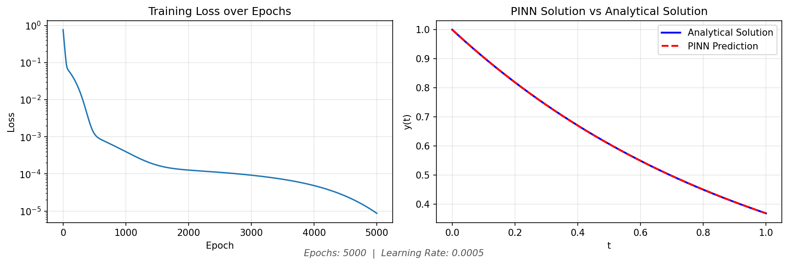

## Project Title
Physics-Informed Neural Network (PINN) for Solving dy/dt = -y

## Overview
A physics informed neural network is similar to a traditional neural network, but
it is trained against a physics-informed loss function that includes both
the differential equation and the initial condition.

This project is a simple demonstration of a PINN being used to solve
a simple ODE with a known analytical solution.

The PINN is being used to solve the ODE
`dy/dt + y = 0`
with the initial condition 
`y(0) = 1`.

The analytical solution to this ODE is known to be `y(t) = e^(-t)`.

The PINN's results are compared to the analytical solution in the
results png file created upon completion of the training script.

## Installation

### Prerequisites
- Python 3.x
- pip
- torch
- numpy
- matplotlib
- datetime

### Setup
- Clone the repository
- Install dependencies from requirements.txt
- Command: `pip install -r requirements.txt`

## Usage
In the terminal, run the training script with the following command:
`python train.py <N_EPOCHS> <LR>`

Where <N_EPOCHS> is the number of epochs to train for and <LR> is the learning rate. The default values are 10000 and 0.001 respectively.

The script will train the PINN for the specified number of epochs and save the results to a png file with the name `pinn_results_YYYYMMDD_HHMMSS.png`.

## Results

The results png file will contain two plots:
- Loss convergence over training
- Comparison of trained PINN prediction vs analytical solution

## Code Structure
- `pinn.py`: PINN model implementation
- `train.py`: Training script with visualization

## How It Works
The PINN is a standard pytorch feedforward neural network with 2 hidden layers of 20 neurons each. The PINN is trained against a physics-informed loss function that includes both the differential equation and the initial condition.

The physics loss is computed by evaluating the differential equation against the PINN's prediction at the collocation points and taking the mean squared error of the residual. This is computed using pytorch's autograd functionality to compute the gradient of the PINN's prediction with respect to the input time values.

The boundary loss is computed by evaluating the initial condition against the PINN's prediction at the initial time point and taking the mean squared error of the residual.

## Hyperparameters
N_EPOCHS: Number of epochs to train for
LR: Learning rate
N_SAMPLES: Number of collocation points

## Blog Post
- TODO: Add link to blog post when published

## References
- Raissi, M., Perdikaris, P., & Karniadakis, G. E. (2019). Physics-informed neural networks: A deep learning framework for solving forward and inverse problems involving nonlinear partial differential equations. Journal of Computational Physics, 378, 686-707.

## License
- MIT License

## Author
- George ElMassih
- GitHub: https://github.com/elmassihgeorge
- Website: https://wp.nyu.edu/artsampscience-elmassihgeorge
- Email: elmassihgeorge at nyu dot edu

